# 📋 ІНСТРУКЦІЯ З НАЛАШТУВАННЯ СЕРВІСУ ІНСТАГРАМ НОВИН

[🔙 Повернутися до головної сторінки](README.md)

## Важливо! : Потрібно мати профіль користувача Facebook та Instagram (публічний або як ще його називають професійний).

### 1. Потрібно створити обліковий запис розробника в Facebook. Отже, перейдіть [сюди](https://developers.facebook.com/) , виконайте необхідні налаштування згідно з [пункту офіційної інструкції Facebook](https://developers.facebook.com/docs/development/register?locale=ru_RU) по реєстрації акаунту розробника.

- В подальшому використанні потрібн буде лише логінитися до вашого облікового запису Facebook натиснувши на "Log In" в меню навігації сайту 
- Ввести ваші дані для входу до вашого облікового запису Facebook 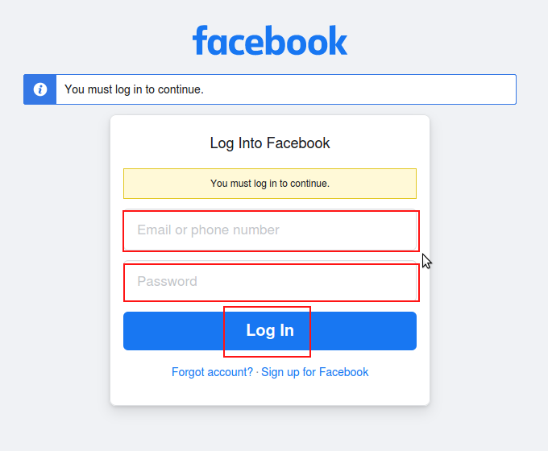

  та натиснути кнопку "Log In"

- Після підтвердження входу, в навігації сайту з'явиться пункт мої додатки "My Apps" 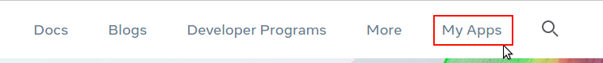

  потрібно перейти за ним.

### 2. Початок створення додатку

- Якщо ви тільки завершили реєстрацію, натисніть кнопку створити перший додаток "Create First App" як показано в кроку №1 [офіційної інструкції Facebook](https://developers.facebook.com/docs/development/create-an-app?locale=ru_RU), та на зображенні нижче, в інших випадках кнопка матиме назву "Create App", потрібно натиснути на неї
  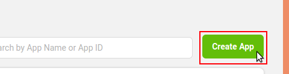

- Потім потрібно вибрати тип додатку, вибираємо останній пункт "Інший" або "None", як показано в кроку №2 [офіційної інструкції Facebook](https://developers.facebook.com/docs/development/create-an-app?locale=ru_RU) та на зображенні нижче,
  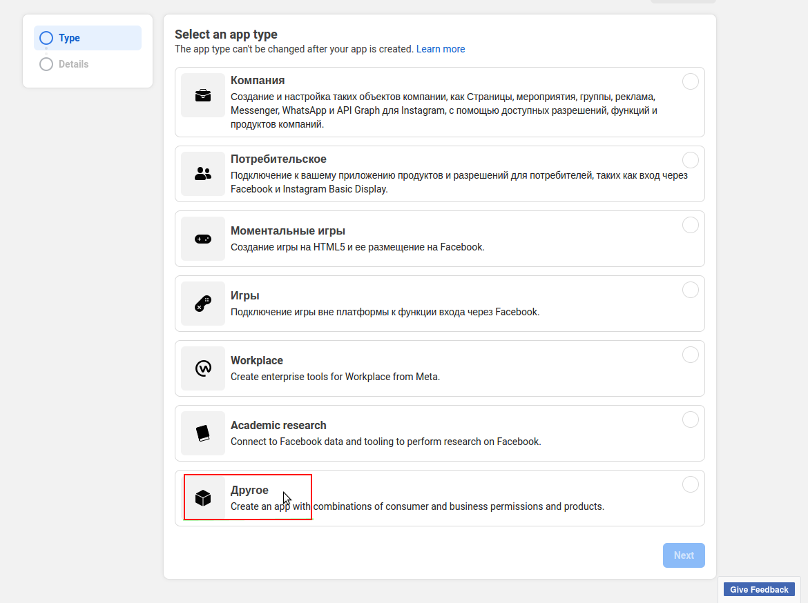
  та натискаємо на кнопку "Next"
  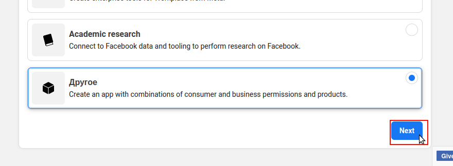

- Наступним кроком буде вказати назву додатку та контактний email за яким з вами можна зв'язатися з приводу вашого додатку та натиснути кнопку "Create App", як показано в кроку №3 [офіційної інструкції Facebook](https://developers.facebook.com/docs/development/create-an-app?locale=ru_RU), та на зображенні нижче,
  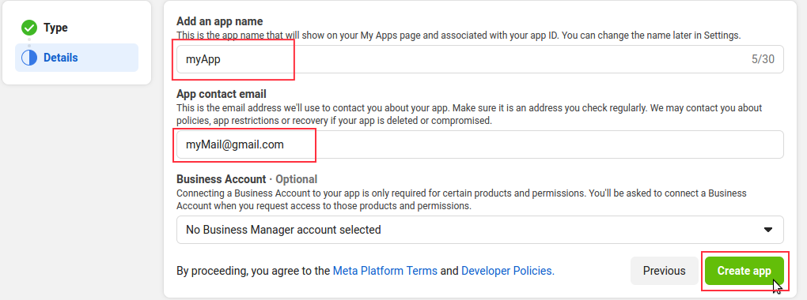

- Потім потрібно підтвердити створення додатку, ввівши пароль вашого акаунту Facebook, та натиснувши кнопку підтвердження
  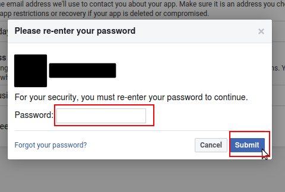

### 3. Налаштування API вашого додатку

- Після підтвердження створення вас переадресує на сторінку вашого додатку де потрібно буде обрати тип API для нього, вибираємо "Instagram Basic Display" та тиснемо налаштувати або "Set up"
  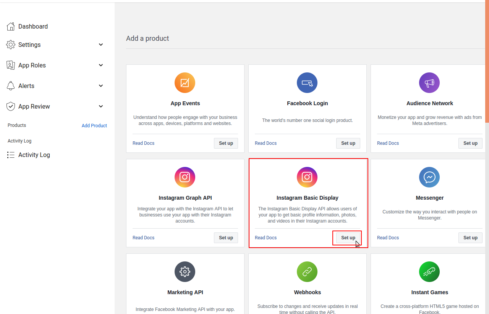

- В наступному вікні вас попередять про необхідність оновлення налаштувань додатку наступним повідомленням
  

- Для цього тиснемо налаштування в навігації збоку та підпункт базові або "Basic"
  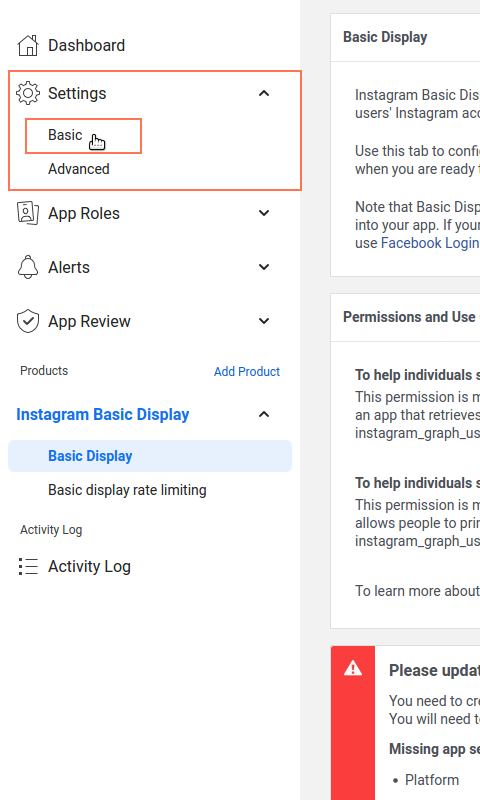

- Потрібно перейти вниз сторінки та додати платформу
  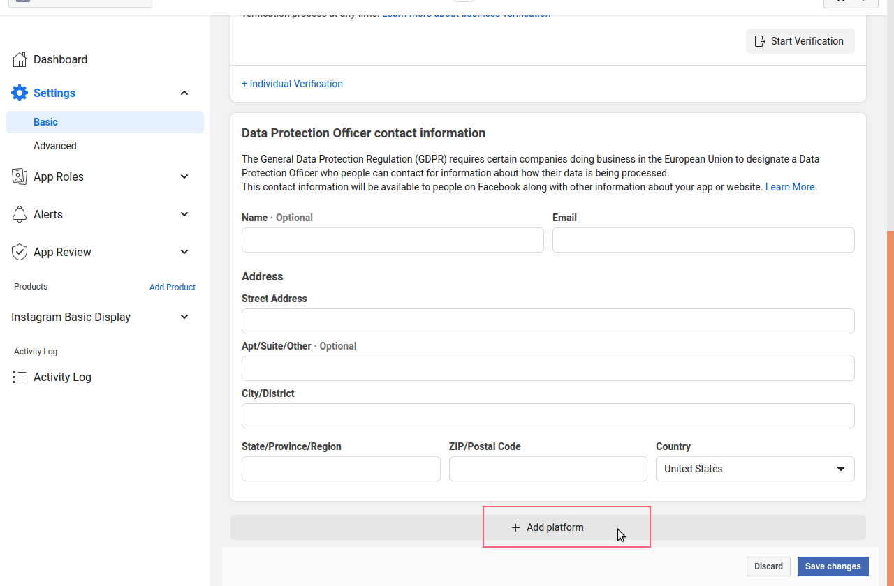

- В модальному вікні вибераємо тип платформи "веб-сайт"
  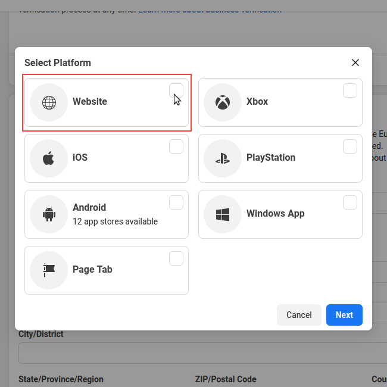

та тиснемо далі

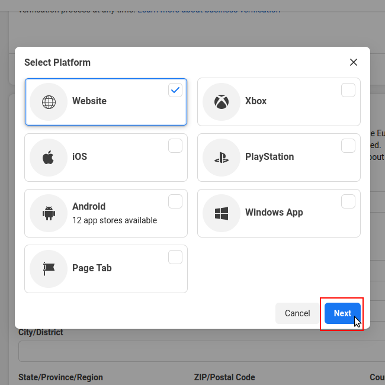

- Тепер внизу сторінки з'явиться поле "веб-сайт" в якому потрібно ввести адресу свого веб-сайту та зберегти
  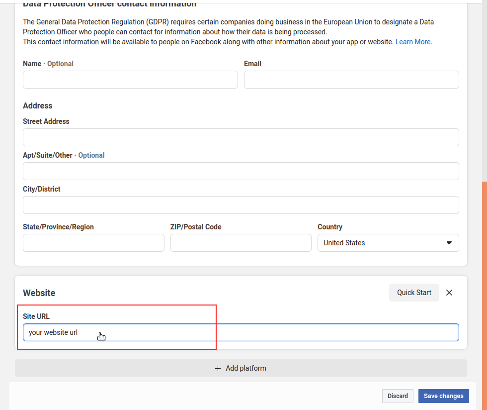
  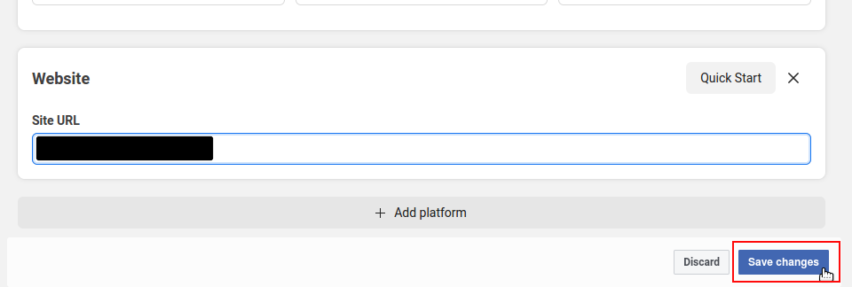

### 4. Створення самого додатку

- Для цього тиснемо "Instagram Basic Display" в навігації збоку та підпункт "Basic Display"

  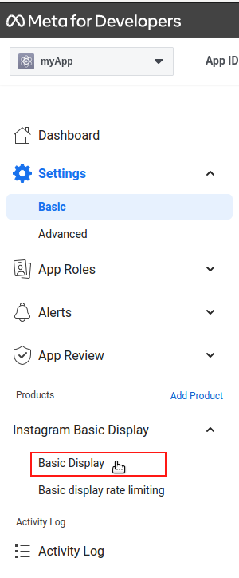

- Опускаємося до низу сторінку та бачимо довгоочікувану кнопку "Сворити новий додаток" на яку тиснемо 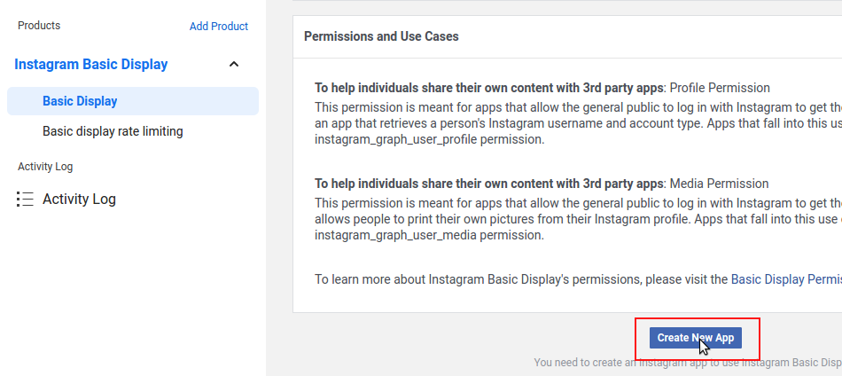

- В новому модальному вікні бачимо назву нашого додатку введену раніше, та тиснемо кнопку "Створити додаток" або "Create App"

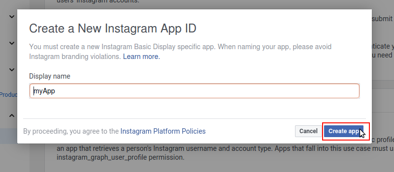

Ваш додаток Instagram створено! Але це ще не все)))

- Тепер, коли вашу програму створено прокрутиму сторінку трішки нижче до пункту назви додатку, та додамо нашу URL-адресу в налаштування OAuth клієнта, скасування авторизації та запит на видалення даних. Наразі це наш локальний хост, але не забудьте змінити його, коли запустите свій веб-сайт на хостингу

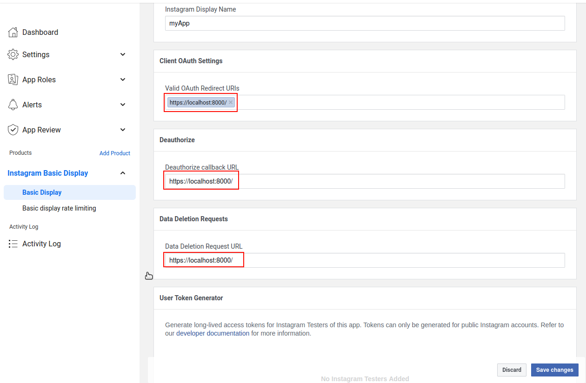

та збережемо зміни

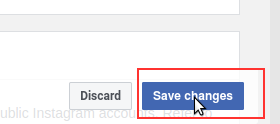

### 5. Додання користувача інстаграму

- В навігації збоку тиснемо ролі в додатку "App Roles" та підпункт ролі "Roles"

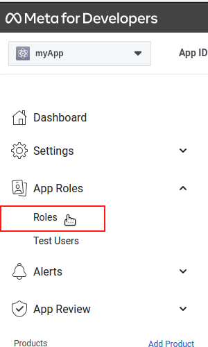

- Далі опускаємося вниз сторінки до пункту тестувальники інстаграм "Instagram Testers", та тиснемо додати тестера

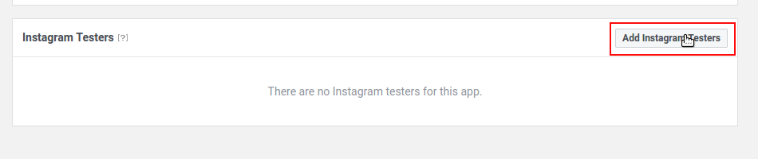

- В модальному вікні пишемо назву профілю який додамо до нашого додатку, в випадаючому меню знайдемо саме той профійль який потрібно та тиснемо на нього і він буде доданий в поле

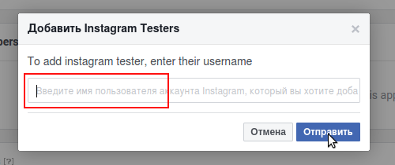

ваш обліковий запис Instagram має бути професійним (публічним). Насправді це можна змінити лише одним клацанням миші. Просто зайдіть у свій Instagram, «Налаштування», «Акаунт» і внизу синім кольором ви побачите опцію перейти на професійний обліковий запис. Якщо ваш обліковий запис не є публічним, він може не відображатися в списку.

- Далі тиснемо відправити

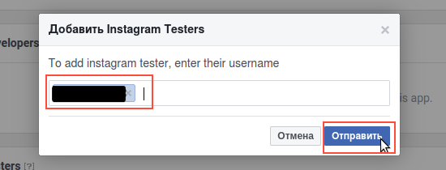

- Тепер коли запрошення до провілю відправлене, він відображатиметься в списку з позначкою на розгляненні, тепер переходимоза посиланням "Додатки та сайти" за яким відкриється нова окрема сторінка входу до істаграм, де потрібно залогінитися в профіль якому було надіслано запрошення якщо ви ще не зробили цього на пристрої з якого створюєте додаток

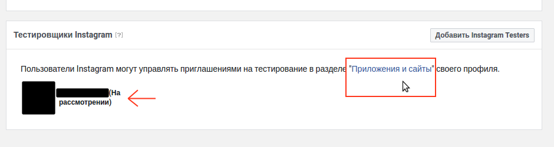

- Переходимо до меню "Додатки та сайти" та вибираємо пункт "Запрошення для тестувальників" де буде показано запрошення та назву нашого додатку, приймаємо запрошення

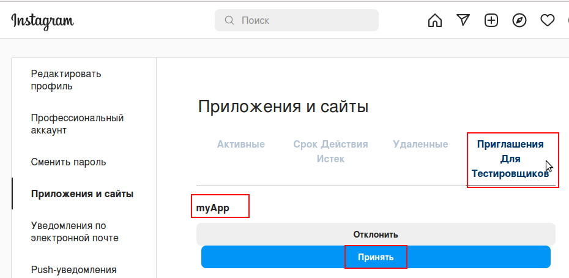

- Повертаємось до сторінки Facebook профілю розробника та оновлюємо її, в полі тестувальники з нашим профілем позначки "на розгляненні" вже повинно не бути

- В навігації збоку тиснемо "Instagram Basic Display" підпункт "Basic Display"

- Тепер опускаємось вниз сторінки до розділу "Генератор маркерів користувача". Тут буде відображений профіль інстаграм що додано, тиснемо "Генерувати Токен"

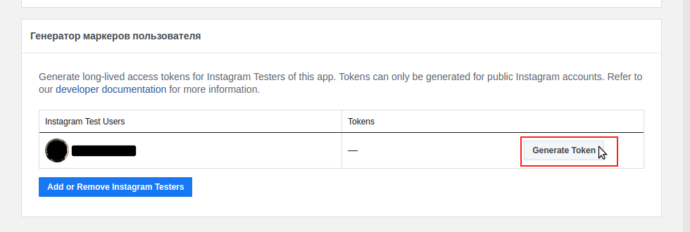

- Відкриеться окреме вікно де потрібно уввійти до доданого профілю інстаграм ввівши дані для входу та натиснувши вхід

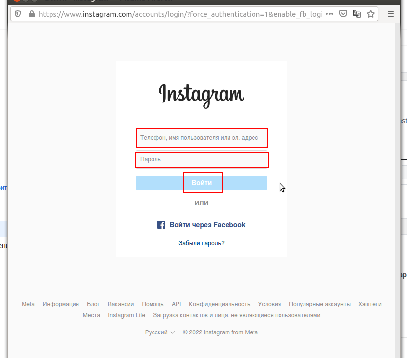

- В наступному меню потрібно підтвердити дозвіл на отримання інформації з профілю та публікації натиснувши дозволити

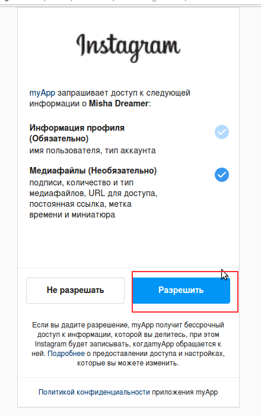

- Тепер на сторінці Facebook профілю розробника відкриється модальне вікно з новим токеном який потрібен для роботи сервісу з відображення публікацій інстаграм профілю на сайті

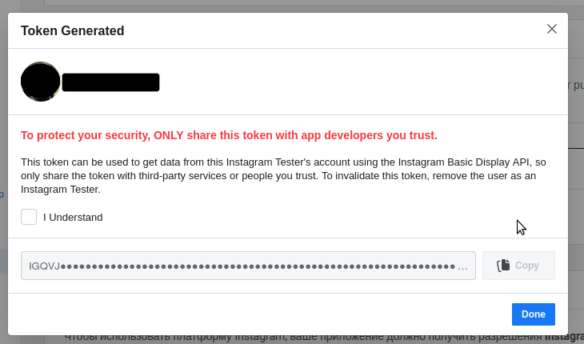

- Далі ставимо маркер в полі "Я розумію", наш токен стане видимим, тиснемо "копіювати", та зберігаємо його, нам він знадобиться на хостинку для вказання значення змінної для роботи сервісу

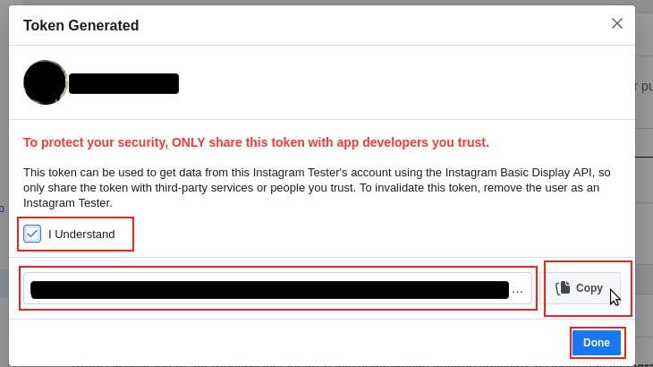

- Переконання що токен згенеровано буде напис в полі токен що "Токен згенеровано"
  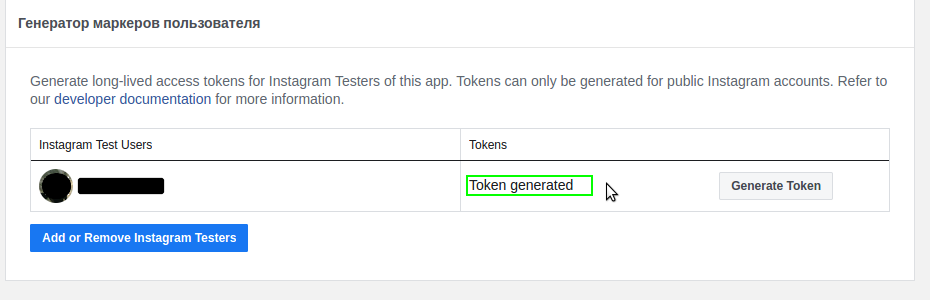

Мої вітання! Тепер можемо використовувати наш токен для відображення публікацій інстаграм профілу на сайті! Фінальним кроком буде додавання змінної оточення на хостингу де розміщується сайт з назвою "GATSBY_APP_INS_TOKEN" та значенням отриманого токену!

## Важливо! Строк дії токену 60 днів з дня отримання

- Потрібно завчасно оновлювати токен повторивши всі пункти починаючи з натискання на кнопку "Генерувати токен" та замінювати старий токен на новий на хостингу

- Для перевірки строку дії переходимо за посилання на [Відладчик маркерів доступу](https://developers.facebook.com/tools/debug/accesstoken/) тиснемо пункт "Маркер доступу" та вставляємо в поле токен який використовуємо для сайту, тиснемо "Відладка"

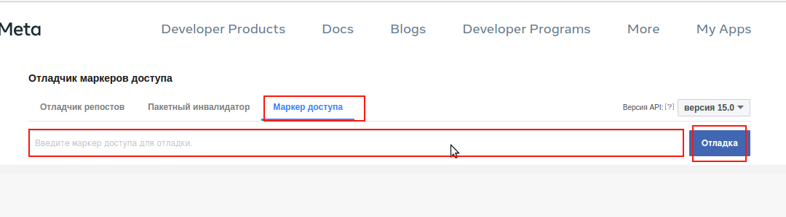

- Далі буде показано дані про токен, коли виданий, коли закінчується щоб мати розуміння чи вже потрібно його оновлювати

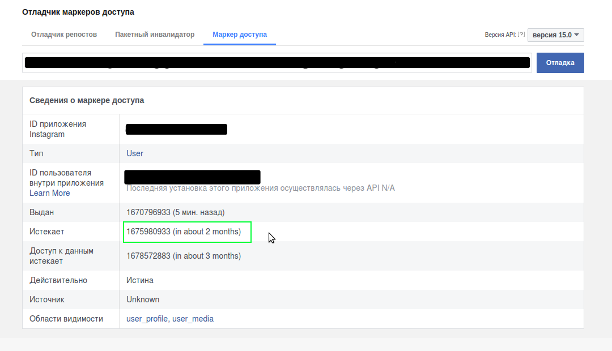

# Корисні посилання

- За приклад було взято крок №2 [інструкції створення додатку інстаграм та отримання токену](https://frontend-digest.com/how-to-automatically-display-your-instagram-feed-on-your-gatsby-js-website-bc5cc324eb9d)

- Та офіційну [інтсрукцію від Facebook](https://developers.facebook.com/docs/development)

[🔙 Повернутися до головної сторінки](README.md)
